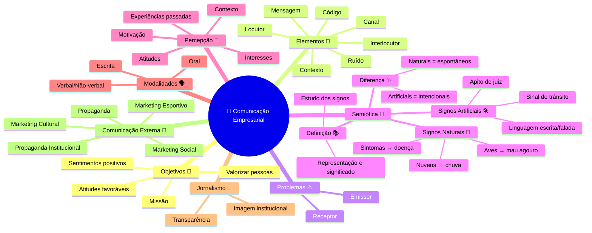

# 📖 Resumo – Comunicação Empresarial

## 🎯 Objetivos
- Divulgar missão e posicionamento da organização.  
- Despertar sentimentos positivos no público externo.  
- Valorizar recursos humanos e reconhecer contribuições.  
- Promover atitudes favoráveis à empresa.  

## 🔑 Elementos da Comunicação
- Locutor (emissor)  
- Interlocutor (receptor)  
- Mensagem (conteúdo)  
- Código (signos usados)  
- Canal (meio de transmissão)  
- Contexto (situação)  
- Ruído (barreiras)  

## ⚠️ Problemas de Comunicação
- **Do emissor**: incoerência, frases longas, excesso de detalhes, linguagem afetada.  
- **Do receptor**: distração, falta de conhecimento, barreiras linguísticas.  

## 🧩 Semiótica e Signos
### 📚 O que é Semiótica?
- Ciência que estuda os **signos** e sua função na comunicação.  
- Um signo é algo que **representa ou remete a outra coisa**.  
- Exemplo: cor preta → pode significar luto.  

👉 Em resumo: **semiótica = estudo dos sistemas de significação**.

### 🌱 Signos Naturais
- Não criados pelo homem, mas **interpretados** por ele.  
- Exemplos:  
  - Nuvens negras → chuva.  
  - Voo de aves → mau agouro.  
  - Sintomas → doença.  
- 📌 Característica: surgem espontaneamente, sem intenção humana.  

### 🛠️ Signos Artificiais
- Criados **intencionalmente pelo homem** para transmitir mensagens.  
- Exemplos:  
  - Apito de juiz → sinal de falta.  
  - Sinal de trânsito → regras de circulação.  
  - Linguagem escrita/falada → sistema organizado de signos.  
- 📌 Característica: possuem **intencionalidade** e são construídos culturalmente.  

### ✨ Diferença Essencial
- **Naturais**: espontâneos, interpretados a partir da natureza.  
- **Artificiais**: criados pelo homem com objetivo comunicativo.  

## 👀 Percepção
- Influenciada por atitudes, motivação, interesses, experiências passadas e contexto.  
- O comportamento é baseado na percepção, não na realidade objetiva.  

## 🗣️ Modalidades
- **Oral**: emoção, entonação, gestos, fisionomia.  
- **Escrita**: clareza, eficiência em mensagens longas.  
- **Verbal e não-verbal**: complementares.  

## 📰 Jornalismo Empresarial
- Evita sensacionalismo.  
- Deve ser transparente e fortalecer a imagem institucional.  

## 📢 Comunicação Externa
- **Propaganda**: foco no consumidor.  
- **Propaganda Institucional**: responsabilidade social.  
- **Marketing Social, Cultural e Esportivo**: apoio a saúde, educação, esportes e cultura.  

---

# 🗺️ Mapa Mental 

